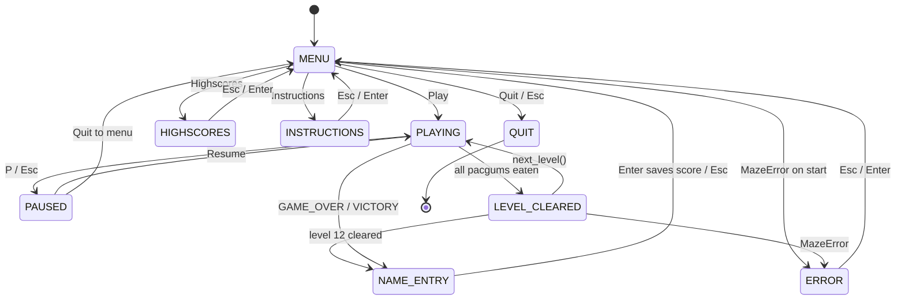

# Application screens

*State diagram*

The `Screen` enum drives both input routing (`_handlers`) and drawing (`_draw`). Closing the window exits from any state.

```mermaid
stateDiagram-v2
  [*] --> MENU
  MENU --> PLAYING : Play
  MENU --> HIGHSCORES : Highscores
  MENU --> INSTRUCTIONS : Instructions
  MENU --> QUIT : Quit / Esc
  HIGHSCORES --> MENU : Esc / Enter
  INSTRUCTIONS --> MENU : Esc / Enter
  MENU --> ERROR : MazeError on start
  ERROR --> MENU : Esc / Enter
  PLAYING --> PAUSED : P / Esc
  PAUSED --> PLAYING : Resume
  PAUSED --> MENU : Quit to menu
  PLAYING --> LEVEL_CLEARED : all pacgums eaten
  LEVEL_CLEARED --> PLAYING : next_level()
  LEVEL_CLEARED --> NAME_ENTRY : level 12 cleared
  LEVEL_CLEARED --> ERROR : MazeError
  PLAYING --> NAME_ENTRY : GAME_OVER / VICTORY
  NAME_ENTRY --> MENU : Enter saves score / Esc
  QUIT --> [*]
```

[Back to the index](README.md)
